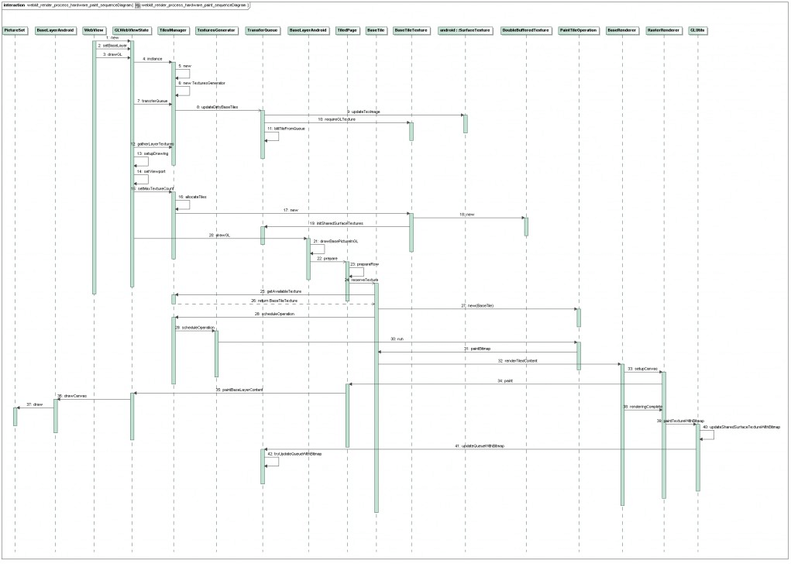

## 总结一
1. 使用代理模式启动到ActivityManagerService中执行；  
2. 创建ActivityRecord到mHistory记录中；  
3. 通过socket通信到Zgote相关类创建process；  
4. 通过ApplicationThread与ActivityManagerService建立通信；  
5. ActivityManagerService通知ActiveThread启动Activity的创建；  
6. ActivityThread创建Activity加入到mActivities中并开始调度Activity执行；  

## 总结二

1. Step 1 - Step 10：应用程序的MainActivity通过Binder进程间通信机制通知ActivityManagerService，它要启动一个新的Activity；  
2. Step 11 - Step 15：ActivityManagerService通过Binder进程间通信机制通知MainActivity进入Paused状态；  
3. Step 16 - Step 22：MainActivity通过Binder进程间通信机制通知ActivityManagerService，它已经准备就绪进入Paused状态，于是ActivityManagerService就准备要在MainActivity所在的进程和任务中启动新的Activity了；  
4. Step 23 - Step 29：ActivityManagerService通过Binder进程间通信机制通知MainActivity所在的ActivityThread，现在一切准备就绪，它可以真正执行Activity的启动操作了。  

