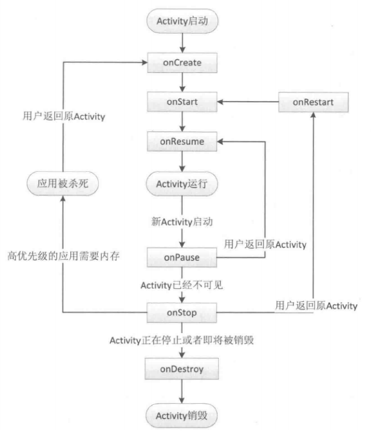
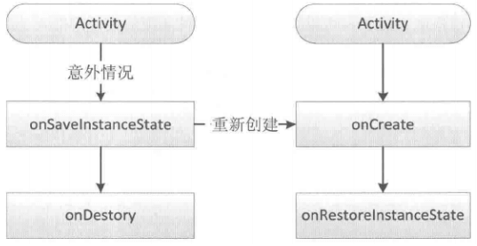

### 
Activivity生命周期图

### 
异常情况下Activity的重建过程

由于Activity是在异常情况下终止的，系统会调用onSaveInstanceState来保存当前Activity的状态（只在异常情况下才调用）。此方法调用时机是在onStop之前，但和onPause没有固定的关系。

onRestoreInstanceState的调用时机在onStart之后。

每个view都有自己的onSaveInstanceState方法。

onRestoreInstanceState中的Bundle一定是有值的，而onCreate中的Bundle在正常情况下没有值。

### Activity的启动模式：

- standard：默认模式。

- singleTop：栈顶复用。例子：新闻客户端的新闻内容页面。

- singleTask：栈内复用。例子：浏览器的主界面。

- singleInstance：单实例模式。例子：闹铃提醒。

默认情况下，所有Activity所需的任务栈的名字为应用的包名。

### IntentFilter匹配规则：
- 一个过滤规则中可以有多个action，只要Intent中的action能和过滤规则中的任何一个action相同即可匹配成功。

- Intent中的所有category都要匹配上过滤规则中的category才算匹配成功。

- data由mimeType和URI组成。和action类似，它也要求Intent中必须含有data数据，并且能够完全匹配filter中的某一个data。

