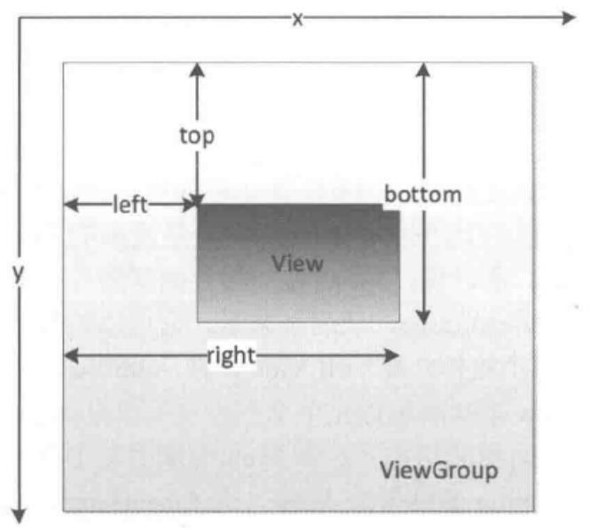

在Android中，x轴和y轴的正方向分别为右和下。

<center></center>

另外，x和y是view左上角的坐标，而translationX和translationY是View左上角相对于父容器的偏移量。

有三种方式可以实现view的滑动：

- 通过view本身提供的scrollTo/scrollBy方法来实现滑动

- 通过动画给view施加平移效果来实现滑动

- 通过改变view的layoutparams使得view重新布局从而实现滑动

Scroller:

```
public class ScrollerLayout extends ViewGroup {

    private Scroller mScroller;

    public ScrollerLayout(Context context, AttributeSet attrs) {
        super(context, attrs);
        mScroller = new Scroller(context);
    }
    @Override
    public void computeScroll() {
        // 重写computeScroll()方法，并在其内部完成平滑滚动的逻辑
        if (mScroller.computeScrollOffset()) {
            scrollTo(mScroller.getCurrX(), mScroller.getCurrY());
            invalidate();
        }
    }
}
```

然后调用scrollerLayout.scrollTo即可。scrollTo只能移动view的内容而不是view本身。

实现弹性滑动的三种方法：scroller、动画、Thread.sleep。

###触摸事件

```


public boolean dispatchTouchEvent(MotionEvent event)
{

	boolean consume = false;

	if(onInterceptTouchEvent(ev))
 {

		consume = onTouchEvent(ev);

	}
 else
 {

		consume = child.dispatchTouchEvent(ev);
	
	}
		
	return consume;
	
}
```


OnTouchListener的优先级比onTouchEvent要高

。如果给一个view设置了OnTouchListener，那么OnTouchListener中的onTouch方法会被回调。这时事件如何处理还要看onTouch的返回值，如果返回false，那么当前view的onTouchEvent方法会被调用；如果返回true，那么onTouchEvent方法将不会被调用。


在onTouchEvent方法中，如果当前view设置了OnClickListener，那么它的onClick方法会被调用，所以OnClickListener的优先级最低。


点击事件产生后，它的传递过程遵循如顺序，Activity->Window->View

如果一个View的onTouchEvent方法返回false，那么它的父容器的onTouchEvent方法将会被调用，依次类推，如果所有的元素都不处理这个事件，那么这个事件将会最终传递给Activity处理（调用Activity的onTouchEvent方法）


同一个事件序列是以down事件开始，中间含有数量不定的move事件，最终以up事件结束。


正常情况下，一个事件序列只能被一个View拦截且消耗。一旦一个元素拦截了某次事件，那么同一个事件序列内的所有事件都会直接交给它处理，因此同一个事件序列中的事件不能分别由两个View同时处理，但是通过特殊手段可以做到，比如一个View将本该自己处理的事件通过onTouchEvent强行传递给其他View处理。


某个View一旦开始处理事件，如果它不消耗ACTION_DOWN事件，那么同一事件序列的其他事情都不会再交给它来处理，并且事件将重新交给它的父容器去处理（调用父容器的onTouchEvent方法）；如果它消耗ACTION_DOWN事件，但是不消耗其他类型事件，那么这个点击事件会消失，父容器的onTouchEvent方法不会被调用，当前view依然可以收到后续的事件，但是这些事件最后都会传递给Activity处理。


ViewGroup默认不拦截任何事件。Android源码中ViewGroup的onInterceptTouchEvent方法默认返回false，View没有onInterceptTouchEvent方法，一旦有点击事件传递给它，那么它的onTouchEvent方法就会调用。


View的onTouchEvent默认都会消耗事件（返回true），除非它是不可点击的（clickable和longClickable同时为false）。View的longClickable属性默认都为false，clickable要分情况，比如Button的clickable属性默认为true，而TextView的clickable属性默认为false。


