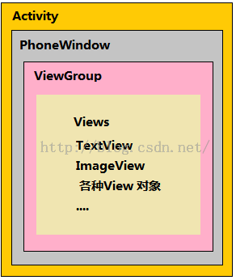
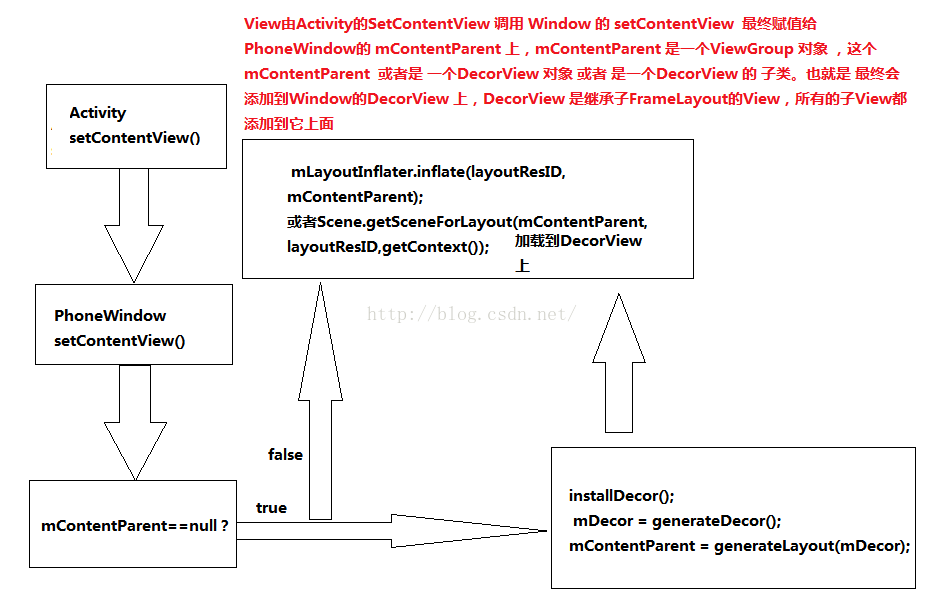
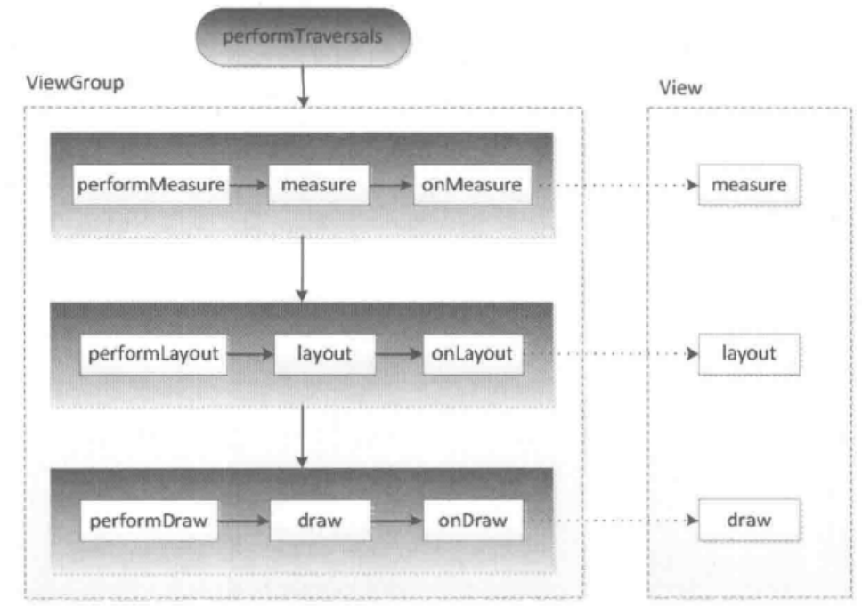
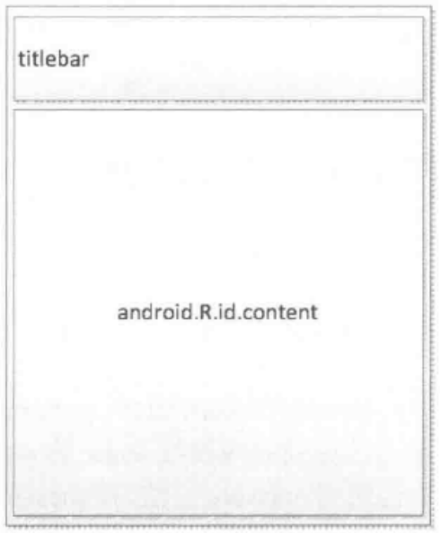
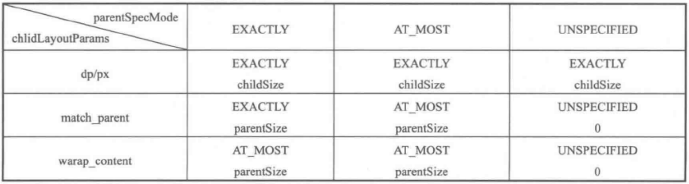

一个Window中View根节点DecorView, 它的mParent称为ViewRoot, 对应ViewRootImpl类, 它不是View的子类, 而是个ViewParent。 ViewRootImpl是连接Window和DecorView的纽带, View的焦点, 按键, 布局, 渲染等流程都是从ViewRoot中开始的。

### Activity、Window和ViewGroup之间的关系





View的绘制流程是从ViewRoot的performtraversal开始的。



### DecorView的结构



MeasureSpec的概念：略

在测量的时候，系统会将LayoutParams在父容器的约束下转换成对应的MeasureSpec，然后再根据这个MeasureSpec来决定View测量后的宽高。

### MeasureSpec创建规则



### View工作流程

- measure过程

如果只是一个view，那么通过measure方法就完成了测量过程。如果是一个Viewgroup，除了完成自己的测量过程外，还会遍历调用所有子元素的measure方法。

系统可能需要多次measure才能确定最终的测量宽/高。一个比较好的习惯是在onLayout方法中获取测量宽高。

- layout过程

在日常开发中，可以认为View的测量宽/高就等于最终宽/高，但是存在某些特殊情况会导致两者不一致，如：
```
public void layout(int l, int t, int r, int b){
	super.layout(l, t, r + 100, b + 100);
}

- draw过程

 - 绘制背景

 - 绘制自己

 - 绘制children

 - 绘制装饰

### 自定义view的分类

- 继承View重写onDraw方法

- 继承ViewGroup派生特殊的Layout

- 继承特定的View

- 继承特定的ViewGroup


