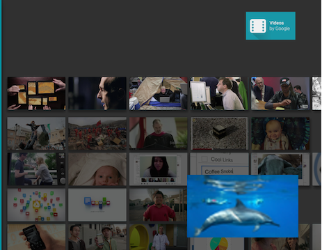

## 8.0新特性

### 通知渠道

开发者可以让用户对不同种类的通知进行精细控制，用户可以单独拦截或更改每个渠道的行为，而不是统一管理应用的所有通知。

	#### 创建通知渠道的步骤：

	1. 创建 NotificationChannel 对象，并设置应用内唯一的通知 ID。
	2. 配置通知渠道的属性，比如提示声音等。
	3. 在 NotificationManager 中注册通知渠道对象。

### 画中画模式

是一种多窗口显示模式，多用于视频播放，即你可以一边发微信一边看视频。
   
 

### 自适应图标

Android O 支持创建自适应图标，系统可以基于设备选择的蒙版将这些图标显示为不同形状。

首先你需要在 Application 标签中加入 Android:icon 属性，定义你的 icon 图标。其次如果你需要创建一个原型的 icon，你还需要加入 Android:roundIcon 属性。

接下来，你需要 res/mipmap-anydpi/ic_launcher.xml 文件中定义您的图层。在 <maskable-icon> 选项中加入您的前景和背景图层。

## Android 7.0 新特性

### 多窗口支持
在运行 Android N 的手机和平板电脑上，用户可以并排运行两个应用，或者处于分屏模式时一个应用位于另一个应用之上。 

 

### JIT/AOT 编译
在 Android N 中，我们添加了 Just in Time (JIT) 编译器，对 ART 进行代码分析，让它可以在应用运行时持续提升 Android 应用的性能。

Android 运行组件的 JIT 编译器最实际的好处之一是应用安装和系统更新的速度。

### 低电耗模式

Android 6.0（API 级别 23）引入了低电耗模式，当用户设备未插接电源、处于静止状态且屏幕关闭时，该模式会推迟 CPU 和网络活动，从而延长电池寿命。而 Android N 则通过在设备未插接电源且屏幕关闭状态下、但不一定要处于静止状态（例如用户外出时把手持式设备装在口袋里）时应用部分 CPU 和网络限制，进一步增强了低电耗模式。

