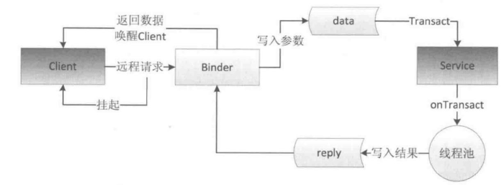

## 多进程模式

在Android中使用多进程只有一种方法，就是给四大组件在Manifest中指定android:process属性。

### 使用多进程的常见问题

- 静态成员和单例模式完全失效
- 线程同步机制完全失效
- SharedPreferences的可靠性下降
- Application会多次创建

## IPC基础概念

### Serializable和Parcelable
- Serializable使用简单但开销大，序列化和反序列化需要大量IO操作。
- Parcelable是安卓推荐的序列化方式，性能较好但存储和网络传输较为复杂。

### Binder
Binder是一个类，它实现了IBinder接口。
- 从IPC角度来说，Binder是Android中的一种跨进程通讯方式。
- 从Framework角度来说，Binder是ServiceManager连接各种Manager和相应ManagerService的桥梁。
- 从Android应用层来说，Binder是客户端和服务端进行通信的媒介。

示例代码：

#### Book.java:

```Java
public class Book implements Parcelable {

    public int bookId;
    public String bookName;

    public Book() {

    }

    public Book(int bookId, String bookName) {
        this.bookId = bookId;
        this.bookName = bookName;
    }

    public int describeContents() {
        return 0;
    }

    public void writeToParcel(Parcel out, int flags) {
        out.writeInt(bookId);
        out.writeString(bookName);
    }

    public static final Parcelable.Creator<Book> CREATOR = new Parcelable.Creator<Book>() {
        public Book createFromParcel(Parcel in) {
            return new Book(in);
        }

        public Book[] newArray(int size) {
            return new Book[size];
        }
    };

    private Book(Parcel in) {
        bookId = in.readInt();
        bookName = in.readString();
    }

}
```

### Binder的工作机制



我们完全可以不提供AIDL文件即可实现Binder，之所以提供AIDL文件，是为了方便系统为我们生成代码。

手动实现一个Binder可以通过以下步骤完成：

1. 声明一个AIDL性质的接口，只要继承IInterface接口即可：

```
public interface IBookManager extends IInterface {

    static final String DESCRIPTOR = "com.ryg.chapter_2.manualbinder.IBookManager";

    static final int TRANSACTION_getBookList = (IBinder.FIRST_CALL_TRANSACTION + 0);
    static final int TRANSACTION_addBook = (IBinder.FIRST_CALL_TRANSACTION + 1);

    public List<Book> getBookList() throws RemoteException;

    public void addBook(Book book) throws RemoteException;
}
```

2.自己实现Binder：

```
public class BookManagerImpl extends Binder implements IBookManager {

    /** Construct the stub at attach it to the interface. */
    public BookManagerImpl() {
        this.attachInterface(this, DESCRIPTOR);
    }

    /**
     * Cast an IBinder object into an IBookManager interface, generating a proxy
     * if needed.
     */
    public static IBookManager asInterface(IBinder obj) {
        if ((obj == null)) {
            return null;
        }
        android.os.IInterface iin = obj.queryLocalInterface(DESCRIPTOR);
        if (((iin != null) && (iin instanceof IBookManager))) {
            return ((IBookManager) iin);
        }
        return new BookManagerImpl.Proxy(obj);
    }

    @Override
    public IBinder asBinder() {
        return this;
    }

    @Override
    public boolean onTransact(int code, Parcel data, Parcel reply, int flags)
            throws RemoteException {
        switch (code) {
        case INTERFACE_TRANSACTION: {
            reply.writeString(DESCRIPTOR);
            return true;
        }
        case TRANSACTION_getBookList: {
            data.enforceInterface(DESCRIPTOR);
            List<Book> result = this.getBookList();
            reply.writeNoException();
            reply.writeTypedList(result);
            return true;
        }
        case TRANSACTION_addBook: {
            data.enforceInterface(DESCRIPTOR);
            Book arg0;
            if ((0 != data.readInt())) {
                arg0 = Book.CREATOR.createFromParcel(data);
            } else {
                arg0 = null;
            }
            this.addBook(arg0);
            reply.writeNoException();
            return true;
        }
        }
        return super.onTransact(code, data, reply, flags);
    }

    @Override
    public List<Book> getBookList() throws RemoteException {
        // TODO 待实现
        return null;
    }

    @Override
    public void addBook(Book book) throws RemoteException {
        // TODO 待实现
    }

    private static class Proxy implements IBookManager {
        private IBinder mRemote;

        Proxy(IBinder remote) {
            mRemote = remote;
        }

        @Override
        public IBinder asBinder() {
            return mRemote;
        }

        public java.lang.String getInterfaceDescriptor() {
            return DESCRIPTOR;
        }

        @Override
        public List<Book> getBookList() throws RemoteException {
            Parcel data = Parcel.obtain();
            Parcel reply = Parcel.obtain();
            List<Book> result;
            try {
                data.writeInterfaceToken(DESCRIPTOR);
                mRemote.transact(TRANSACTION_getBookList, data, reply, 0);
                reply.readException();
                result = reply.createTypedArrayList(Book.CREATOR);
            } finally {
                reply.recycle();
                data.recycle();
            }
            return result;
        }

        @Override
        public void addBook(Book book) throws RemoteException {
            Parcel data = Parcel.obtain();
            Parcel reply = Parcel.obtain();
            try {
                data.writeInterfaceToken(DESCRIPTOR);
                if ((book != null)) {
                    data.writeInt(1);
                    book.writeToParcel(data, 0);
                } else {
                    data.writeInt(0);
                }
                mRemote.transact(TRANSACTION_addBook, data, reply, 0);
                reply.readException();
            } finally {
                reply.recycle();
                data.recycle();
            }
        }
    }
}
```

上述代码和系统生成的代码几乎是一样的。

Binder中提供了两个配对的方法linkToDeath和unlinkToDeath，可以设置死亡代理，一旦Binder死亡时，我们就可以收到通知。

## Android中的IPC方式

- 使用Intent中的Bundle

- 使用文件共享

- 使用Messenger（它的底层实现是AIDL）

- 使用AIDL

 - 服务端首先要创建一个Service用来监听客户端的连接请求，然后创建一个AIDL文件，将暴露给客户端的接口在这个AIDL文件中声明，最后在Service中实现这个接口即可。

 - 客户端首先绑定服务端Service，然后将服务端返回的Binder对象转成AIDL接口所属的类型，接着就可以调用AIDL中的方法了。

- 使用socket
