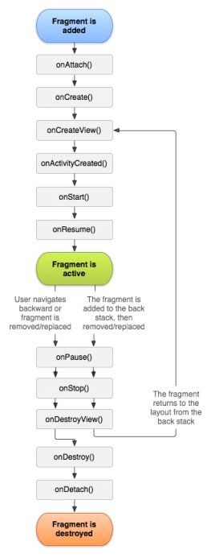

## Fragment生命周期




* `public void onAttach(Context context)`
  
	* onAttach方法会在Fragment与窗口关联后立刻调用。从该方法开始，就可以通过Fragment.getActivity方法获取与Fragment关联的窗口对象，但因为Fragment的控件未初始化，所以不能够操作控件。  


* `public void onCreate(Bundle savedInstanceState)`
	
	* 在调用完onAttach执行完之后立刻调用onCreate方法，可以在Bundle对象中获取一些在Activity中传过来的数据。

* `public View onCreateView(LayoutInflater inflater, ViewGroup container,Bundle savedInstanceState)`

	* 在该方法中创建在Fragment显示的View。
	

* `public void onViewCreated(View view,Bundle savedInstanceState)`

	* Android在创建完Fragment中的View对象之后，会立刻回调该方法。

* `public void onActivityCreated(Bundle savedInstanceState)`

	* 在Activity的onCreate方法执行完之后，Android系统会立刻调用该方法，表示窗口已经初始化完成。从这个时候开始，就可以在Fragment中使用getActivity().findViewById(Id);来操控Activity中的view了。
	

* `public void onStart()`


* `public void onResume()`


* `public void onPause()`
	

* `public void onStop()`


* `public void onDestroy()`
	
	* Android在Fragment不再使用时会调用该方法，这时Activity可以获得Fragment对象，但无法对获得的Fragment进行任何操作。


* `public void onDetach()`
	
	* 当该方法执行完后，Fragment与Activity不再有关联。

## Fragment与Activity之间的交互

* Fragment与Activity之间的交互可以通过`Fragment.setArguments(Bundle args)`以及`Fragment.getArguments()`来实现。


## Fragment状态的持久化


* 方法一：

	* 可以通过`protected void onSaveInstanceState(Bundle outState)`,`protected void onRestoreInstanceState(Bundle savedInstanceState)` 状态保存和恢复的方法将状态持久化。

* 方法二(更方便,让Android自动帮我们保存Fragment状态)：

	* `FragmentManager.putFragment(Bundle bundle, String key, Fragment fragment)`


		Put a reference to a fragment in a Bundle. This Bundle can be persisted as saved state, and when later restoring getFragment(Bundle, String) will return the current instance of the same fragment.

		Parameters
		- bundle	The bundle in which to put the fragment reference.
		- key	The name of the entry in the bundle.
		- fragment	The Fragment whose reference is to be stored.

	这个方法仅仅能够保存Fragment中的控件状态，比如说EditText中用户已经输入的文字（*注意！在这里，控件需要设置一个id，否则Android将不会为我们保存控件的状态*），而Fragment中需要持久化的变量依然会丢失。

## FragmentTransaction


```
	
	
FragmentTransaction transaction = fm.beginTransaction();
transaction.add()
transaction.remove()
transaction.replace()

transaction.show()
//显示之前隐藏的Fragment

transatcion.commit()

```
	


* 管理回退栈
	
	* ``FragmentTransaction.addToBackStack(String)``
	* ``getSupportFragmentManager().getBackStackEntryCount()``
	* ``getSupportFragmentManager().popBackStack(String name, int flags)``
	* ``getSupportFragmentManager().popBackStack(int id, int flags)``
