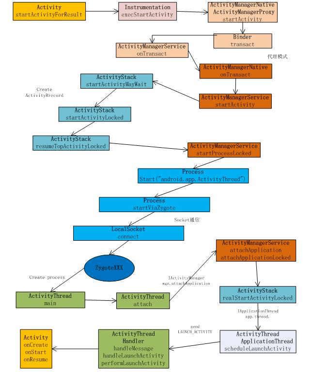
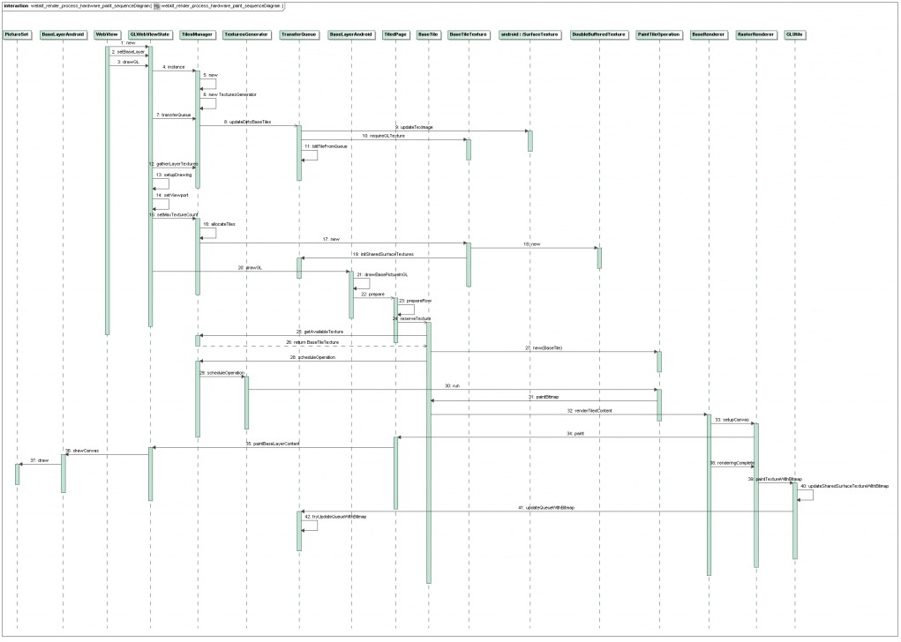

## 总结一
1. 使用代理模式启动到ActivityManagerService中执行；  
2. 创建ActivityRecord到mHistory记录中；  
3. 通过socket通信到Zgote相关类创建process；  
4. 通过ApplicationThread与ActivityManagerService建立通信；  
5. ActivityManagerService通知ActiveThread启动Activity的创建；  
6. ActivityThread创建Activity加入到mActivities中并开始调度Activity执行；  

## 总结二

1.Activity.startActivity  
2.Activity.startActivityForResult  
3.Instrumentation.execStartActivity  
- 
4.ActivityManagerProxy.startActivity  
5.ActivityManagerService.startActivity  
6.ActivityStack.startActivityMayWait  
7.ActivityStack.startActivityLocked  
8.ActivityStack.startActivityUncheckedLocked  
9.ActivityStack.resumeTopActivityLocked  
10.ActivityStack.startPausingLocked  

11.ApplicationThreadProxy.schedulePauseActivity  
12.ApplicationThread.schedulePauseActivity  
13.ActivityThread.queueOrSendMessage  
14.H.handleMessage  
15.ActivityThread.handlePauseActivity  

16.ActivityManagerProxy.activityPaused  
17.ActivityManagerService.activityPaused  
18.ActivityStack.activityPaused  
19.ActivityStack.completePauseLocked  
20.ActivityStack.resumeTopActivityLocked  
21.ActivityStack.startSpecificActivityLocked  
22.ActivityStack.realStartActivityLocked  

23.ApplicationThreadProxy.scheduleLaunchActivity  
24.ApplicationThread.scheduleLaunchActivity  
25.ActivityThread.queueOrSendMessage  
26.H.handleMessage  
27.ActivityThread.handlerLaunchActivity  
28.ActivityThread.performLaunchActivity  
29.onCreate  

1. Step 1 - Step 10：应用程序的MainActivity通过Binder进程间通信机制通知ActivityManagerService，它要启动一个新的Activity；  
2. Step 11 - Step 15：ActivityManagerService通过Binder进程间通信机制通知MainActivity进入Paused状态；  
3. Step 16 - Step 22：MainActivity通过Binder进程间通信机制通知ActivityManagerService，它已经准备就绪进入Paused状态，于是ActivityManagerService就准备要在MainActivity所在的进程和任务中启动新的Activity了；  
4. Step 23 - Step 29：ActivityManagerService通过Binder进程间通信机制通知MainActivity所在的ActivityThread，现在一切准备就绪，它可以真正执行Activity的启动操作了。  

ActivityManagerService和ActivityStack位于同一进程中，而ApplicationThread和ActivityThread位于另一进程中。ActivityManagerService负责管理Activity的生命周期，ActivityManagerService还借助ActivityStack来把所有的Activity按先后顺序放在一个堆栈中。对于每一个应用程序来说，都有一个ActivityThread来表示应用程序的主进程，而每一个ActivityThread都包含一个ApplicationThread。ApplicationThread是一个Binder，负责和其他进程进行通信。

