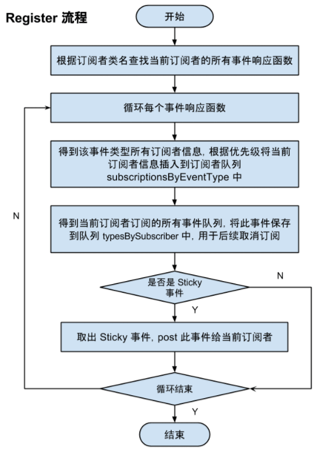
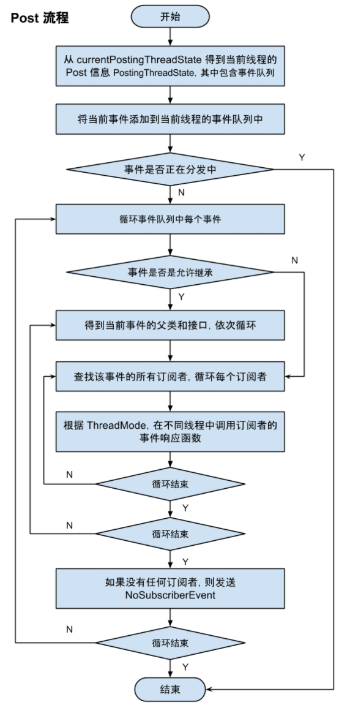

##ThreadMode

- **PostThread**：默认的 ThreadMode，表示在执行 Post 操作的线程直接调用订阅者的事件响应方法，不论该线程是否为主线程（UI 线程）。

- **MainThread**：在主线程中执行响应方法。

- **BackgroundThread**：在后台线程中执行响应方法。如果发布线程不是主线程，则直接调用订阅者的事件响应函数，否则启动唯一的后台线程去处理。适用场景：操作轻微耗时且不会过于频繁，即一般的耗时操作都可以放在这里。

- **Async**：不论发布线程是否为主线程，都使用一个空闲线程来处理。和BackgroundThread不同的是，Async类的所有线程是相互独立的，因此不会出现卡线程的问题。适用场景：长耗时操作，例如网络访问。