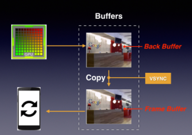
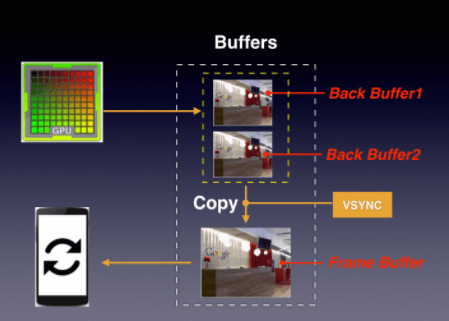
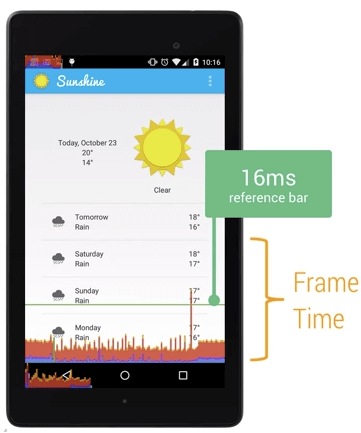
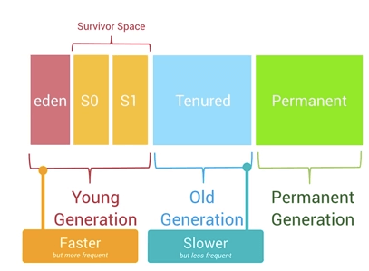

##Understanding Overdraw

Overdraw(过度绘制)描述的是屏幕上的某个像素在同一帧的时间内被绘制了多次的现象。我们可以通过手机设置里面的开发者选项，打开Show GPU Overdraw的选项，观察UI上的Overdraw情况。

##Understanding VSync
刷新频率和帧率并不是总能够保持相同的节奏。如果发生帧率与刷新频率不一致的情况，就会容易出现Tearing的现象。VSync就是用于解决这个问题的。

###双缓冲机制：

GPU 向 Back Buffer 中写数据，屏幕从 Frame Buffer 中读数据。VSync 信号负责调度从 Back Buffer 到 Frame Buffer 的复制操作，可认为该复制操作在瞬间完成。其实，该复制操作是等价后的效果，实际上双缓冲的实现方式是交换 Back Buffer 和 Frame Buffer 的名字，更具体的说是交换内存地址

###三缓冲机制：

双重缓存的缺陷在于：当 CPU/GPU 绘制一帧的时间超过 16 ms 时，会产生 Jank。

###Tool:Profile GPU Rendering

打开手机里面的开发者选项，选择Profile GPU Rendering，选中On screen as bars的选项。随着界面的刷新，界面上会滚动显示垂直的柱状图来表示每帧画面所需要渲染的时间，柱状图越高表示花费的渲染时间越长。

##Overdraw, Cliprect, QuickReject

我们可以通过canvas.clipRect()来帮助系统识别那些可见的区域。这个方法可以指定一块矩形区域，只有在这个区域内才会被绘制，其他的区域会被忽视。

我们还可以使用canvas.quickreject()来判断是否没和某个矩形相交，从而跳过那些非矩形区域内的绘制操作。

我们可以通过上面介绍的Show GPU Overdraw来查看效果。

##Memory Churn and performance

通常来说，单个的GC并不会占用太多时间，但是大量不停的GC操作则会显著占用帧间隔时间(16ms)。

导致GC频繁执行有两个原因：

- Memory Churn内存抖动，内存抖动是因为大量的对象被创建又在短时间内马上被释放。
- 瞬间产生大量的对象会严重占用Young Generation的内存区域，当达到阀值，剩余空间不够的时候，也会触发GC。

我们还可以通过Allocation Tracker来查看在短时间内，同一个栈中不断进出的相同对象。这是内存抖动的典型信号之一。

##Garbage Collection in Android

Android里面是一个三级Generation的内存模型，最近分配的对象会存放在Young Generation区域，当这个对象在这个区域停留的时间达到一定程度，它会被移动到Old Generation，最后到Permanent Generation区域。

每一个级别的内存区域都有固定的大小，此后不断有新的对象被分配到此区域，当这些对象总的大小快达到这一级别内存区域的阀值时，会触发GC的操作，以便腾出空间来存放其他新的对象。

##Performance Cost of Memory Leaks
内存泄漏使得每级Generation的内存区域可用空间变小，GC就会更容易被触发，从而引起性能问题。

寻找内存泄漏并修复这个漏洞是件很棘手的事情，你需要对执行的代码很熟悉，清楚的知道在特定环境下是如何运行的，然后仔细排查。

##Battery Performance
有下面一些措施能够显著减少电量的消耗：

- 我们应该尽量减少唤醒屏幕的次数与持续的时间，使用WakeLock来处理唤醒的问题，能够正确执行唤醒操作并根据设定及时关闭操作进入睡眠状态。
- 某些非必须马上执行的操作，例如上传歌曲，图片处理等，可以等到设备处于充电状态或者电量充足的时候才进行。
- 触发网络请求的操作，每次都会保持无线信号持续一段时间，我们可以把零散的网络请求打包进行一次操作，避免过多的无线信号引起的电量消耗。

如果发现我们的App有电量消耗过多的问题，我们可以使用JobScheduler API来对一些任务进行定时处理，例如我们可以把那些任务重的操作等到手机处于充电状态，或者是连接到WiFi的时候来处理。 

JobScheduler API会根据当前的情况与任务，组合出理想的唤醒时间，例如等到正在充电或者连接到WiFi的时候，或者集中任务一起执行。
