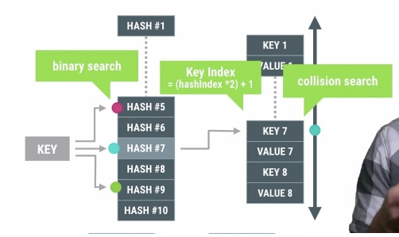
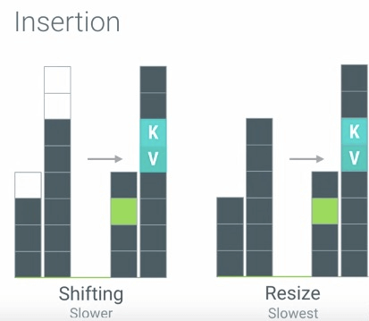

## Fun with ArrayMaps

很明显，ArrayMap的插入与删除的效率是不够高的。

## SparseArray Family Ties
为了避免HashMap的autoboxing行为，Android系统提供了SparseBoolMap，SparseIntMap，SparseLongMap，LongSparseMap等容器。关于这些容器的基本原理请参考前面的ArrayMap的介绍，另外这些容器的使用场景也和ArrayMap一致。

## The price of ENUMs
Android官方强烈建议不要在Android程序里面使用到enum。

## DO NOT LEAK VIEWS

- 避免使用异步回调
- 避免使用Static对象
- 避免把View添加到没有清除机制的容器里面

## Network Performance 101

- 我们应该使用回退机制来避免固定频繁的同步请求，例如，在发现返回数据相同的情况下，推迟下次的请求时间。

- 其次，我们还可以使用Batching(批处理)的方式来集中发出请求，避免频繁的间隔请求。

- 最后，我们还可以使用Prefetching(预取)的技术提前把一些数据拿到，避免后面频繁再次发起网络请求。

Google Play Service中提供了一个叫做GCMNetworkManager的类来帮助我们实现上面的那些功能。
