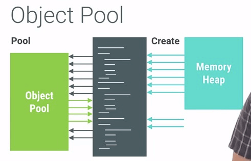
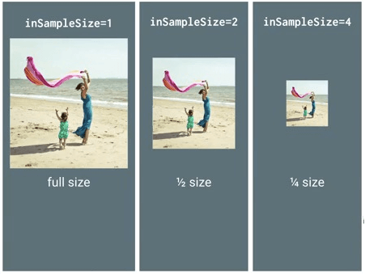

## Battery Drain and Networking
当程序想要执行某个网络请求之前，需要先唤醒设备，然后发送数据请求，之后等待返回数据，最后才慢慢进入休眠状态。


我们可以有针对性的把请求行为捆绑起来，延迟到某个时刻统一发起请求。

## Object Pools



使用对象池技术有很多好处，它可以避免内存抖动，提升性能。使用对象池也有不好的一面，程序员需要手动管理这些对象的分配与释放，所以我们需要慎重地使用这项技术，避免发生对象的内存泄漏。

## The Magic of LRU Cache


使用LRU Cache能够显著提升应用的性能，可是也需要注意LRU Cache中被淘汰对象的回收，否者会引起严重的内存泄露。

## Hidden Cost of Transparency


大多数情况下，屏幕上的元素都是由后向前进行渲染的。在上面的图示中，会先渲染背景图(蓝，绿，红)，然后渲染人物头像图。如果后渲染的元素有设置alpha值，那么这个元素就会和屏幕上已经渲染好的元素做blend处理。

很多时候，我们会给整个View设置alpha的来达到fading的动画效果，如果我们图示中的ListView做alpha逐渐减小的处理，我们可以看到ListView上的TextView等等组件会逐渐融合到背景色上。但是在这个过程中，我们无法观察到它其实已经触发了额外的绘制任务，我们的目标是让整个View逐渐透明，可是期间ListView在不停的做Blending的操作，这样会导致不少性能问题。

我们可以先按照通常的方式把View上的元素按照从后到前的方式绘制出来，但是不直接显示到屏幕上，而是使用GPU预处理之后，再用GPU渲染到屏幕上，GPU可以对界面上的原始数据直接做旋转，设置透明度等等操作。

```
setLayerType(View.LAYER_TYPE_HARDWARE, null)
viewPropertyAnimator.alpha(0.0f).withLayer();
setLayerType(View.LAYER_TYPE_NONE, null)
```

注意：如果绘制的内容过于简单，则使用硬件加速会得不偿失，反而降低性能。

## Tool: Strict Mode
Android提供了一个叫做Strict Mode的工具，我们可以通过手机设置里面的开发者选项，打开Strict Mode选项，如果程序存在潜在的隐患，屏幕就会闪现红色。

```
public void onCreate() {
     if (DEVELOPER_MODE) {
         StrictMode.setThreadPolicy(new StrictMode.ThreadPolicy.Builder()
                 .detectDiskReads()
                 .detectDiskWrites()
                 .detectNetwork()   // or .detectAll() for all detectable problems
                 .penaltyLog()
                 .build());
         StrictMode.setVmPolicy(new StrictMode.VmPolicy.Builder()
                 .detectLeakedSqlLiteObjects()
                 .detectLeakedClosableObjects()
                 .penaltyLog()
                 .penaltyDeath()
                 .build());
     }
     super.onCreate();
}
```

## Pre-scaling Bitmaps


还有一个经常使用到的技巧是inJustDecodeBounds，使用这个属性去尝试解码图片，可以事先获取到图片的大小而不至于占用什么内存。

## Re-using Bitmaps
使用inBitmap属性可以告知Bitmap解码器去尝试使用已经存在的内存区域，新解码的bitmap会尝试去使用之前那张bitmap在heap中所占据的pixel data内存区域，而不是去问内存重新申请一块区域来存放bitmap。

```
BitmapFactory.Options options=new BitmapFactory.Options();
options.inBitmap=mCurrentBitmap;
mCurrentBitmap=BitmapFactory.decodeFile(filename,options)
```
