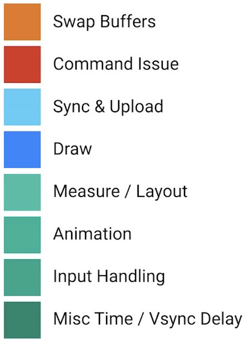

##Memory & Threading
不要在任何非UI线程里面去持有UI对象的引用。系统为了确保所有的UI对象都只会被UI线程所进行创建，更新，销毁的操作，特地设计了对应的工作机制(当Activity被销毁的时候，由该Activity所触发的非UI线程都将无法对UI对象进行操作，否者就会抛出程序执行异常的错误)来防止UI对象被错误地使用。

##Good AsyncTask Hunting
默认情况下，所有的AsyncTask任务都是被线性调度执行的，他们处在同一个任务队列当中，按顺序逐个执行。

为了解决上面提到的线性队列等待的问题，我们可以使用AsyncTask.executeOnExecutor()强制指定AsyncTask使用线程池并发调度任务。

使用AsyncTask很容易导致内存泄漏，一旦把AsyncTask写成Activity的内部类的形式就很容易因为AsyncTask生命周期的不确定而导致Activity发生泄漏。

##Swimming in Threadpools
使用线程池需要特别注意同时并发线程数量的控制，理论上来说，我们可以设置任意你想要的并发数量，但是这样做非常的不好。因为CPU只能同时执行固定数量的线程数，一旦同时并发的线程数量超过CPU能够同时执行的阈值，CPU就需要花费精力来判断到底哪些线程的优先级比较高，需要在不同的线程之间进行调度切换。

Runtime.getRuntime().availableProcesser()方法并不可靠，他返回的值并不是真实的CPU核心数，因为CPU会在某些情况下选择对部分核心进行睡眠处理。

##Profile GPU Rendering : M Update
在Android M版本开始，GPU Profiling工具把渲染操作拆解成如下8个详细的步骤进行显示。

- Sync & Upload：通常表示的是准备当前界面上有待绘制的图片所耗费的时间，为了减少该段区域的执行时间，我们可以减少屏幕上的图片数量或者是缩小图片本身的大小。
- Measure & Layout：这里表示的是布局的onMeasure与onLayout所花费的时间，一旦时间过长，就需要仔细检查自己的布局是不是存在严重的性能问题。
- Animation：表示的是计算执行动画所需要花费的时间，包含的动画有ObjectAnimator，ViewPropertyAnimator，Transition等等。一旦这里的执行时间过长，就需要检查是不是使用了非官方的动画工具或者是检查动画执行的过程中是不是触发了读写操作等等。
- Input Handling：表示的是系统处理输入事件所耗费的时间，粗略等于对于的事件处理方法所执行的时间。一旦执行时间过长，意味着在处理用户的输入事件的地方执行了复杂的操作。
- Misc/Vsync Delay：如果稍加注意，我们可以在开发应用的Log日志里面看到这样一行提示：I/Choreographer(691): Skipped XXX frames! The application may be doing too much work on its main thread。这意味着我们在主线程执行了太多的任务，导致UI渲染跟不上vSync的信号而出现掉帧的情况。