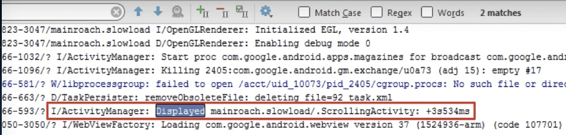
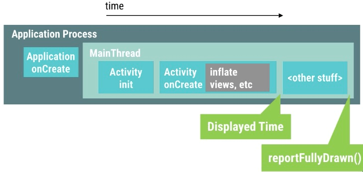
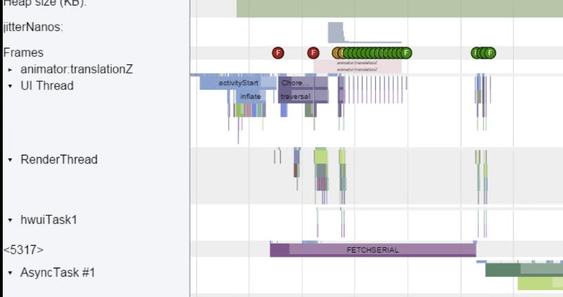

##App Launch time 101
从Android KitKat版本开始，Logcat中会输出从程序启动到某个Activity显示到画面上所花费的时间。这个方法比较适合测量程序的启动时间。

我们可以在异步加载完毕之后调用activity.reportFullyDrawn()方法来告诉系统此时的状态，以便获取整个加载的耗时。

为了获取具体的耗时分布情况，我们可以使用Method Tracing工具来进行详细的测量。

我们可以在onCreate方法里面添加trace.beginSection()与trace.endSection()方法来声明需要跟踪的起止位置，系统会帮忙统计中间经历过的函数调用耗时，并输出报表。

##App Launch Time & Theme Launch Screens

对于启动闪屏，正确的使用方法是自定义一张图片，把这张图片通过设置主题的方式显示为启动闪屏，代码执行到主页面的onCreate的时候设置为程序正常的主题。

##Smaller APKs: A Checklist

- 确保在build.gradle文件中开启了minifEnabled与shrinkResources的属性，这两个属性可以帮助移除那些在程序中使用不到的代码与资源，帮助减少APP的安装包大小。
- 有选择性的提供对应分辨率的图片资源，系统会自动匹配最合适分辨率的图片并执行拉伸或者压缩的处理。
- 在符合条件的情况下，使用Vertor Drawable替代传统的PNG/JPEG图片，能够极大的减少图片资源的大小。（VectorDrawable通过XML文件描述图片的形状，大小，样式）
- 尽量复用已经存在的资源图片，使用代码的方式对已有的资源进行复用。
- 使用一些更加轻量化，专门为Android APP设计的jar类库。

