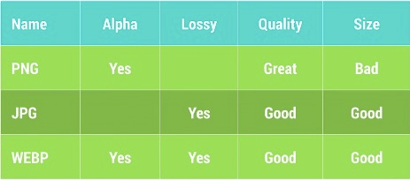

##Adapting to Latency
通常来说，我们可以把网络请求延迟划分为三档：例如把网络延迟小于60ms的划分为GOOD，大于220ms的划分为BAD，介于两者之间的划分为OK。

如果网络延迟属于GOOD的范畴，我们就可以做更多比较激进的预取数据的操作，如果网络延迟属于BAD的范畴，我们就应该考虑把当下的网络请求操作Hold住等待网络状况恢复到GOOD的状态再进行处理。

##Minimizing Asset Payload
网络传输数据量的大小主要由两部分组成：图片与序列化的数据。
###减少图片大小

我们需要为不同的使用场景提供当前场景下最合适的图片大小，例如针对全屏显示的情况我们会需要一张清晰度比较高的图片，而如果只是显示为缩略图的形式，就只需要服务器提供一个相对清晰度低很多的图片即可。
###减少序列化数据的大小
JSON与XML为了提高可读性，在文件中加入了大量的符号，空格等等字符，而这些字符对于程序来说是没有任何意义的。我们应该使用Protocal Buffers，Nano-Proto-Buffers，FlatBuffer来减小序列化的数据的大小。