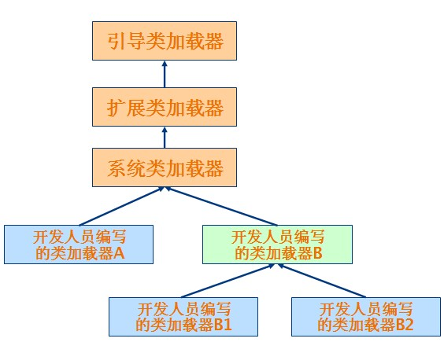

##ClassLoader的分类
- 引导类加载器（bootstrap class loader）：它用来加载 Java 的核心库，是用原生代码来实现的，并不继承自 java.lang.ClassLoader。
- 扩展类加载器（extensions class loader）：它用来加载 Java 的扩展库（javax，如javax.net等）。Java 虚拟机的实现会提供一个扩展库目录。该类加载器在此目录里面查找并加载 Java 类。
- 系统类加载器（system class loader）：它根据 Java 应用的类路径（CLASSPATH）来加载 Java 类。一般来说，Java 应用的类都是由它来完成加载的。可以通过 ClassLoader.getSystemClassLoader()来获取它。

除了系统提供的类加载器以外，开发人员可以通过继承 java.lang.ClassLoader类的方式实现自己的类加载器，以满足一些特殊的需求。

##ClassLoader的继承关系


##代理模式
类加载器在尝试自己去查找某个类的字节代码并定义它时，会先代理给其父类加载器，由父类加载器先去尝试加载这个类，依次类推。  
Java 虚拟机不仅要看类的全名是否相同，还要看加载此类的类加载器是否一样。只有两者都相同的情况，才认为两个类是相同的。  
代理模式是为了保证 Java 核心库的类型安全。通过代理模式，对于 Java 核心库的类的加载工作由引导类加载器来统一完成，保证了 Java 应用所使用的都是同一个版本的 Java 核心库的类，是互相兼容的。  

##类加载过程
###加载
  - 通过类的全限定名来获取定义此类的二进制字节流
  - 将此二进制字节流所代表的静态存储结构转化成方法区的运行时数据结构
  - 在内存中生成代表此类的java.lang.Class对象,作为该类访问入口.

###连接
####验证：确保Class文件的字节流中信息符合虚拟机的要求，不会危害虚拟机安全。
  - 文件格式验证
  - 源数据验证
  - 字节码验证
  - 符号引用验证

####准备
正式为类变量分配内存并设置变量的初始值（仅包含类变量,不包含实例变量）。　　

####解析
虚拟机将常量池中的符号引用替换为直接引用，解析动作主要针对类或接口、字段、类方法、方法类型等等。

- 符号引用
符号引用以一组符号来描述所引用的目标，符号可以是任何形式的字面量。
- 直接引用
  - 直接指向目标的指针（比如，指向“类型”【Class对象】、类变量、类方法的直接引用可能是指向方法区的指针）
  - 相对偏移量（比如，指向实例变量、实例方法的直接引用都是偏移量）
  - 一个能间接定位到目标的句柄

###初始化
真正意义上的开始执行类中定义的Java程序代码。该阶段会执行类构造器。

###使用
使用该类所提供的功能。

###卸载
从内存中释放。

##开发自己的类加载器
```
public class FileSystemClassLoader extends ClassLoader { 
 
   private String rootDir; 
 
   public FileSystemClassLoader(String rootDir) { 
       this.rootDir = rootDir; 
   } 
 
   protected Class<?> findClass(String name) throws ClassNotFoundException { 
       byte[] classData = getClassData(name); 
       if (classData == null) { 
           throw new ClassNotFoundException(); 
       } 
       else { 
           return defineClass(name, classData, 0, classData.length); 
       } 
   } 
 
   private byte[] getClassData(String className) { 
       String path = classNameToPath(className); 
       try { 
           InputStream ins = new FileInputStream(path); 
           ByteArrayOutputStream baos = new ByteArrayOutputStream(); 
           int bufferSize = 4096; 
           byte[] buffer = new byte[bufferSize]; 
           int bytesNumRead = 0; 
           while ((bytesNumRead = ins.read(buffer)) != -1) { 
               baos.write(buffer, 0, bytesNumRead); 
           } 
           return baos.toByteArray(); 
       } catch (IOException e) { 
           e.printStackTrace(); 
       } 
       return null; 
   } 
 
   private String classNameToPath(String className) { 
       return rootDir + File.separatorChar 
               + className.replace('.', File.separatorChar) + ".class"; 
   } 
}
```
