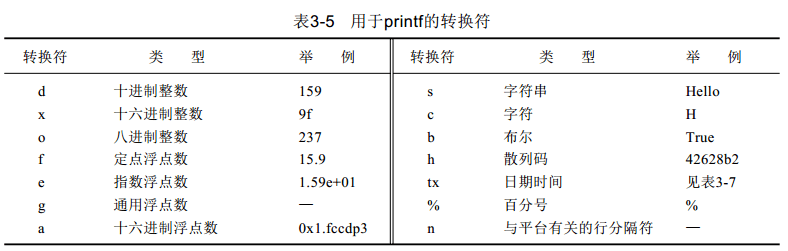

实心箭头表示无信息丢失的转换，虚箭头表示可能有精度损失的转换。

Java将各种字符串存放在公共的存储池中，字符串变量指向存储池中相应的位置。只有字符串常量是共享的，+或substring等操作产生的结果并不是共享的。

- char charAt (int index)
返回给定位置的代码单元。除非对底层的代码单元感兴趣，否则不需要调用这个方法。（然而好像在最近的版本已经可以用了，示例代码如下）

```
public static void main(String[] args){
	 System.out.println("蛤蟆".charAt(0));
	System.out.println("蛤蟆".charAt(1));
	System.out.println("蛤蟆".codePointAt(0));
	System.out.println("蛤蟆".codePointAt(1));
}
```  

输出：  
蛤  
蟆  
34532  
34758  
然后codePointAt(2)就会越界。

String类中的主要方法：  

- int codePointAt(int index)  
- int offsetByCodePoints(int startIndex, int cpCount)   
- int compareTo(String other)  
- boolean endsWith(String suffix)  
- boolean equals(Object other)  
- boolean equalsIgnoreCase(String other)  
- int index0f(String str)  
- int index0f(String str, int fromIndex)  

StringBuilder中的主要方法：

- int length()
- StringBuilder append(String str)
- StringBuilder append(char c)
- StringBuilder appendCodePoint(int cp)
- void setCharAt(int i,char c)
- StringBuilder insert(int offset,String str)
- StringBuilder insert(int offset,Char c)
- StringBuilder delete(int startIndex,int endIndex)
- String toString()



java.util.Arrays 1.2

- static String toString(type[] a)
- static type copyOf(type[] a, int length)
- static type copyOf(type[] a, int start, int end)
- static void sort(type[] a)
- static int binarySearch(type[] a, type v)
- static int binarySearch(type[] a, int start, int end, type v)
- static void fill(type[] a, type v)
- static boolean equals(type[] a, type[] b)
- static void arraycopy(Object from, int fromIndex, Object to, int toIndex,
int count)

Java可以创建不规则数组，只要在声明时不指定第二维的长度即可。
