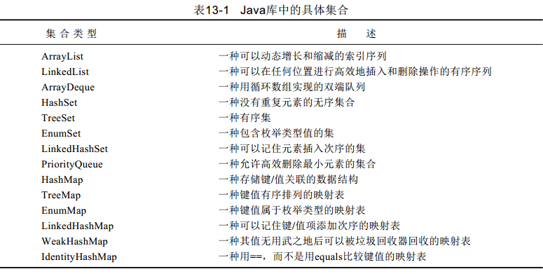
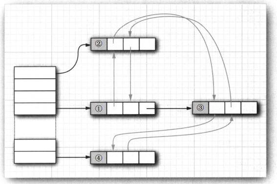
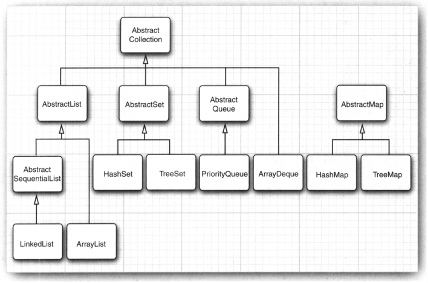

RandomAccess接口没有任何方法，但可以用来检测一个特定的集合是否支持高效的随机访问。

###Collection接口的常见方法：

- boolean add(Object o)
- boolean remove(Object o)
- int size()
- boolean isEmpty()
- boolean contains(Object o)
- Iterator iterator()
- boolean containsAll(Collection c)
- boolean addAll(Collectiion c)
- void clear()
- void removeAll(Collection c)
- void retainAll(Collection c)
- Object[] toArray()。
- Object[] toArray(Object[] a)

###Iterator接口方法：

- hasNext()
- next()
- remove();

对于并发修改列表的检测有一个奇怪的例外。链表只负责跟踪对列表的结构性修改，例如，添加元素、删除元素。 set操作不被视为结构性修改。

java.util.Queue<E> 5.0

- boolean add(E element)
- boolean offer(E element)
- E remove()
- E poll()
- E element()
- E peek()

在Java SE 6中引入了Deque接口，并由ArrayDeque和LinkedList类实现。
这两个类都提供了双端队列，而且在必要时可以增加队列的长度。

优先级队列(priority queue)中的元素可以按照任意的顺序插入，却总是按照排序的顺序进行检索。

- PriorityQueue()
- PriorityQueue(int initialCapacity)
- PriorityQueue(int initialCapacity, Comparator<? super E> c)

注意源码中的accessOrder标志位，当它false时，表示双向链表中的元素按照Entry插入LinkedHashMap到中的先后顺序排序；当它为true时，表示双向链表中的元素按照访问的先后顺序排列。

Arrays.asList返回的对象不是ArrayList。它是一个视图对象，带有访问底层数组的get和set方法。（Collections.toArray可以转成数组）

subList方法也返回一个视图。

Collections.unmodifiableCollection返回不可修改的视图。

如果试图进行不恰当的操作，受限制的视图就会抛出一个UnsupportedOperationException。

###Collections类中的方法：

- sort(List<T> list)
- binarySearch(List<? extends Comparable<? super T>> list, T key)
- reverse(List<?> list)
- shuffle(List<?> list)
- swap(List<?> list, int i, int j)
- fill(List<? super T> list, T obj)
- copy(List<? super T> dest, List<? extends T> src)
- min(Collection<? extends T> coll, Comparator<? super T> comp)
- max(Collection<? extends T> coll, Comparator<? super T> comp)
- rotate(List<?> list, int distance)
- replaceAll()

