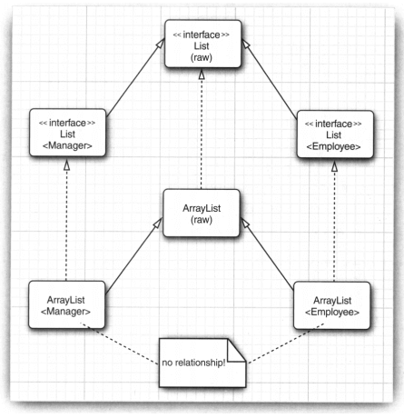
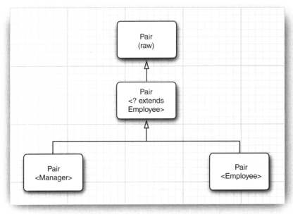

定义泛型方法：

```
public static <T> T methodName(){
 // TODO
}
```

\<T extends Bounding Type > 表示T应该是绑定类型的子类型（ subtype）。 T和绑定类型可以是类，也可以是接口。

类型擦除指的是通过类型参数合并，将泛型类型实例关联到同一份字节码上。类型擦除的关键在于从泛型类型中清除类型参数的相关信息，并且在必要的时候添加类型检查和类型转换的方法。

从Java SE 5.0开始，在一个方法覆盖
另一个方法时可以指定一个更严格的返回类型。

虚拟机中没有泛型，只有普通的类和方法。  
所有的类型参数都用它们的限定类型替换。  
桥方法被合成来保持多态。  
为保持类型安全性，必要时插入强制类型转换。  

if(a instanceof Pair<String>)  实际上仅仅测试a是否是任意类型的一个Pair。

不能抛出也不能捕获泛型类的对象。事实上，泛型类扩展Throwable都不合法。

不能声明参数化类型的数组，如：  
Pair<String>[] table = new Pair<String>[10]  
因为擦除之后，table的类型是Pair[]，赋值Pair<Employee>仍然会通过检测。



```
Manager[] managerBuddies = {ceo, cfo};
Employee[] employeeBuddies = managerBuddies; //OK
employeeBuddies[0] = new Employee() // ArrayStoreException
```

```
List<Manager> managerList = new ArrayList<>();
List list = managerList;
list.add(new Employee()); // 完全能够正常运行
list.get(0);
```
然而Pair<? extends Employee>不能放入任何元素，因为它不知道具体是哪一个子类。



```
List<? super Manager> list = new ArrayList<>();
list.add(new Manager());
Object m = list.get(0); // 完全能够正常运行
```

Pair<?>方法的setFirst方法不能被调用，甚至不能用Object调用。  
那么，如何设置其中的元素呢？

```
public static <T> void swapHelper(Pair<T> p){
	T t = p.getFirst();
	p.setFirst(p.getSecond());
	p.setSecond(t);
}
```

Class类是泛型的，String.class实际上是一个Class<String>类的对象。