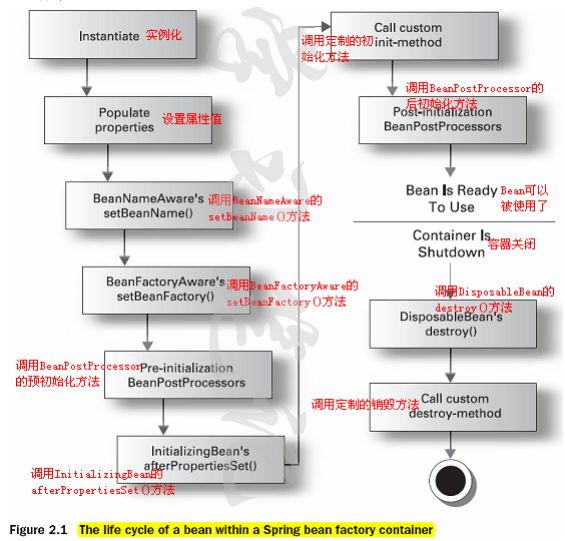
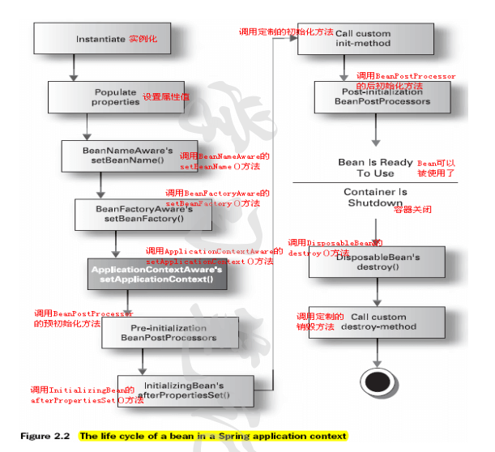

##Spring框架的优点
- 轻量：Spring 是轻量的，基本的版本大约2MB。
- 控制反转：Spring通过控制反转实现了松散耦合，对象们给出它们的依赖，而不是创建或查找依赖的对象们。
- 面向切面的编程(AOP)：Spring支持面向切面的编程，并且把应用业务逻辑和系统服务分开。
- 容器：Spring 包含并管理应用中对象的生命周期和配置。
- MVC框架：Spring的WEB框架是个精心设计的框架，是Web框架的一个很好的替代品。
- 事务管理：Spring 提供一个持续的事务管理接口，可以扩展到上至本地事务下至全局事务（JTA）。
- 异常处理：Spring 提供方便的API把具体技术相关的异常（比如由JDBC，Hibernate or JDO抛出的）转化为一致的unchecked 异常。

## Spring的组成

- Core module
- Bean module
- Context module
- Expression Language module
- JDBC module
- ORM module
- OXM module
- Java Messaging Service(JMS) module
- Transaction module
- Web module
- Web-Servlet module
- Web-Struts module
- Web-Portlet module

##BeanFactory
BeanFactory是工厂模式的一个实现，提供了控制反转功能。

```
public interface BeanFactory {
     Object getBean(String id);
}
```

它有很多种实现类，其中最常用的是XmlBeanFactory。

##ApplicationContext

ApplicationContext接口由BeanFactory接口派生而来，因而提供BeanFactory所有的功能。ApplicationContext以一种更向面向框架的方式工作以及对上下文进行分层和实现继承，ApplicationContext包还提供了以下的功能： 

- MessageSource, 提供国际化的消息访问  
- 资源访问，如URL和文件  
- 事件传播  
- 载入多个（有继承关系）上下文 ，使得每一个上下文都专注于一个特定的层次，比如应用的web层  

ApplicationContext的主要实现有：

- FileSystemXmlApplicationContext ：此容器从一个XML文件中加载beans的定义，XML Bean 配置文件的全路径名必须提供给它的构造函数。
- ClassPathXmlApplicationContext：此容器也从一个XML文件中加载beans的定义，这里，你需要正确设置classpath因为这个容器将在classpath里找bean配置。
- WebXmlApplicationContext：此容器加载一个XML文件，此文件定义了一个WEB应用的所有bean。

##依赖注入
不用创建对象，而只需要描述它如何被创建。不在代码里直接组装你的组件和服务，但是要在配置文件里描述哪些组件需要哪些服务，之后一个容器（IOC容器）负责把他们组装起来。

- 构造器依赖注入：构造器依赖注入通过容器触发一个类的构造器来实现的，该类有一系列参数，每个参数代表一个对其他类的依赖。
- Setter方法注入：Setter方法注入是容器通过调用无参构造器或无参static工厂 方法实例化bean之后，调用该bean的setter方法，即实现了基于setter的依赖注入。

##Beans
###Java bean
Java bean需要符合以下三个条件：

- 有一个无参构造器
- 属性使用public 的get，set方法访问
- 可以序列化

###Spring bean
Spring beans 是那些形成Spring应用的主干的java对象。它们被Spring IOC容器初始化，装配，和管理。注意：它不是线程安全的。

####Spring bean的创建

- XML配置文件。
- 基于注解的配置。
- 基于java的配置。

####Spring bean的作用域

- singleton : bean在每个Spring ioc 容器中只有一个实例。
- prototype：一个bean的定义可以有多个实例。
- request：每次http请求都会创建一个bean，该作用域仅在基于web的Spring ApplicationContext情形下有效。
- session：在一个HTTP Session中，一个bean定义对应一个实例。该作用域仅在基于web的Spring ApplicationContext情形下有效。
- global-session：在一个全局的HTTP Session中，一个bean定义对应一个实例。该作用域仅在基于web的Spring ApplicationContext情形下有效。

####Spring bean的生命周期


