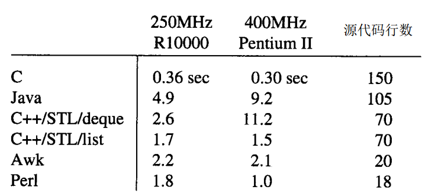

本章设计了一个用马尔科夫链随机生成可以读的英文文本的程序，算法如下：

	设置w1和w2为文本的前两个词
	输出w1和w2
	循环：
    	随机地选出 w3，它是文本中w1、w2的后缀中的一个。
    	打印w3。
    	把w1和w2分别换成w2和w3。
	重复循环
选择了数据结构：

	每个状态由一个前缀和一个后缀链表组成。
	所有这些信息存在一个散列表里，以前缀作为关键码。
	每个前缀是一个固定大小的词集合。
	如果一个后缀在给定前缀下的出现多于一次，则每个出现都单独包含在有关链表里。

并分别用Java、C++、Awk和Perl实现了它。不同语言的性能对比如下： 

本章最后一节是关于设计的经验教训，主要内容有：

- 很容易把 Perl和Awk程序改造成使用一个词或三个词前缀的程序，但要想使这个选择能够参数化，就会遇到很多麻烦。

- 使用较高级的语言比更低级的语言写出的程序速度更慢，但这种说法只是定性的，把它随意推广也是不明智的。大型构件，如 C++的STL或脚本语言里的关联数组、字符串处理，能使代码更紧凑，开发时间也更短。

- 当系统内部提供的代码太多时，人们将无法知道程序在其表面之下到底做了什么。我们应该如何评价这种对控制和洞察力的丧失，这是更不清楚的事情。这也就是 STL版本中遇到的情况，它的性能无法预料，也没有很容易的办法去解决问题。

- 当所有东西都正常运转时，功能丰富的程序设计环境可以是非常有生产效率的，但是如果它们出了毛病，那就没什么东西可以依靠了。如果问题牵涉到的是性能或者某些难于捉摸的逻辑错误时，我们很可能根本没有意识到有什么东西出了毛病。

- 最好是从数据结构开始，在关于可以使用哪些算法的知识的指导下进行详细设计。当数据结构安置好后，代码就比较容易组织了。

- 要想先把一个程序完全设计好，然后再构造它，这是非常困难的。构造现实的程序总需要重复和试验。构造过程逼迫人们去把前面粗略做出的决定弄清楚。

- 做产品代码要花费的精力比做原型多得多。例如可以把这里给出的程序看作是产品代码( 因为它们已经被仔细打磨过，并经过了彻底的测试 )。产品质量要求我们付出的努力要比个人使用的程序高一两个数量级。