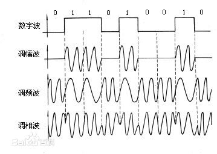

## 第1章 绪论
### 因特网
#### 因特网组成

- **边缘部分**：用户直接使用，用来进行通信（传送数据、音频或视频）和资源共享；
- **核心部分**：由大量网络和连接这些网络的路由器（边缘部分，称端系统(end system)）组成。提供连通性和交换。

#### 处于边缘部分的用户通信方式

- **客户服务器方式**（C/S 方式）：客户是服务的请求方，服务器是服务的提供方
- **对等方式**（P2P 方式）：对等连接中的每一个主机既是客户又同时是服务器。

#### 交换技术

- **电路交换**：在通信之前要在通信双方之间建立一条被双方独占的物理通路。
- **报文交换**：报文交换是以报文为数据交换的单位，报文携带有目标地址、源地址等信息，在交换结点采用存储转发的传输方式。
- **分组交换**：分组交换仍采用存储转发传输方式，但将一个长报文先分割为若干个较短的分组，然后把这些分组（携带源、目的地址和编号信息）逐个地发送出去。

### 计算机网络的分类P17
**广域网 WAN**（Wide Area Network）：因特网的核心部分。   
**城域网 MAN**（Metropolitan Area Network）：很多采用以太网技术。   
**局域网 LAN**（Local Area Network）   
**个人区域网 PAN**（Personal Area Network）   

### 性能指标

- **速率**：b/s（bps）。如100M以太网，实际是指100Mb/s。往往是指额定速率或标称速率。
- **带宽**：数字信道所能传送的最高速率。
- **吞吐量**：单位时间内通过某个网络（或信道、接口）的数据量。其绝对上限值等于带宽。
- **时延**（delay或latency）：数据（一个报文或分组，甚至比特）从网络（或链路）的一段传送到另一端的时间。也称延迟。
 - 发送时延：主机或路由器发送数据帧所需的时间，也就是从发送数据帧的第一个比特算起，到该帧的最后一个比特发送完毕所需的时间。也成传输时延。
 发送时延 = 数据帧长度（b） / 信道带宽（b/s）
 - 传播时延：电磁波在信道中传输一定距离所需划分的时间。
 传播时间 = 信道长度（m） / 传输速率（m/s）
 - 处理时延：主机或路由器处理收到的分组所花费的时间。
 - 排队时延：分组在输入队列中等待处理的时间加上其在输出队列中等待转发的时间。   

往返时间RTT：从发送方发送数据开始，到发送发收到接收方的确认为止所花费的时间。
 
### 计算机网络的体系结构
五层协议的体系结构（从下向上）：  
物理层主要负责在物理线路上传输原始的二进制数据；  
数据链路层主要负责在通信的实体间建立数据链路连接；  
网络层主要负责创建逻辑链路，以及实现数据包的分片和重组，实现拥塞控制、网络互连等功能；  
运输层负责向用户提供端到端的通信服务，实现流量控制以及差错控制；  
应用层为应用程序提供了网络服务。  

### OSI7层体系结构
- 应用层
- 表示层
- 会话层
- 传输层
- 网络层
- 数据链路层
- 物理层

#### TCP/IP体系结构
应用层、运输层、网际层和网络接口层

## 第2章 物理层
### 物理层的主要任务
屏蔽不同硬件设备和传输介质之间的差异，使上层的数据链路层只需考虑本层的服务和协议，而不必考虑硬件设备和传输介质。

### 物理层特性
**机械特性**：指明接口所用接线器的形状和尺寸、引线数目和排列、固定和锁定装置等等。  
**电气特性**：指明在接口电缆的各条线上出现的电压的范围。  
**功能特性**：指明某条线上出现的某一电平的电压表示何种意义。  
**过程特性**：指明对于不同功能的各种可能事件的出现顺序。  

### 传输媒体
#### 导向媒体
- 双绞线
- 同轴电缆
- 光缆
- 架空明线

#### 非导向媒体
- 无线传输
- 短波通信
- 微波

### 信噪比
信号的平均功率与噪声的平均功率的比值。  
  信噪比(dB) = 10 log10(S/N) (dB)   
### 香农公式
信道的极限信息传输速率C：  
  C=W log2(1+S/N) (b/s)     
  W为信道带宽(Hz)，S是信号功率，N是噪声功率   

### 信道复用技术
**频分复用FDM** (Frequency Division Multiplexing)：所有用户在同样的时间占用不同的频率带宽资源。  
**时分复用TDM** (Time Division Multiplexing)则是将时间划分为一段段等长的时分复用帧（TDM 帧）。
**统计时分复用 STDM** (Statistic TDM)是改进的时分复用，明显地提高信道的利用率。
**波分复用 WDM** (Wavelength Division Multiplexing)：光的频分复用
**码分复用 CDM** (Code Division Multiplexing)常用的名词是码分多址 CDMA：有很强的抗干扰能力。每一个比特时间划分为 m 个短的间隔，称为码片(chip)  
